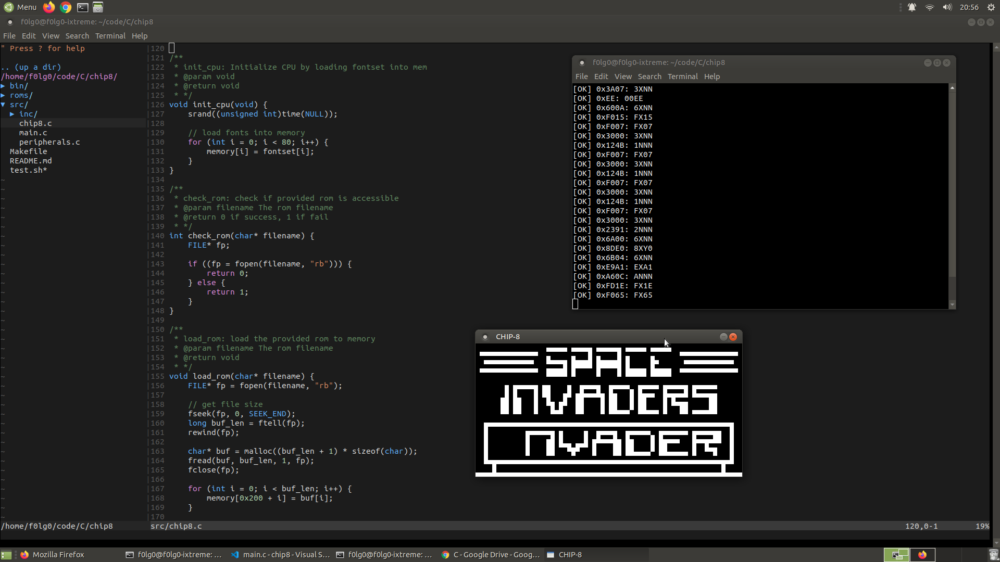

# CHIP-8 Emulator

A simple emulator for the CHIP-8 interpreted programming language written in C (SDL for graphics).

## About

This is a really basic emulator written for educational purposes, the code is meant to be readable and clear, with a lot of comments. I am a beginner in this field and this is my first attempt to emulators. I have implemented this project mainly by following the [Wikipedia page](https://en.wikipedia.org/wiki/CHIP-8) and [this](http://devernay.free.fr/hacks/chip8/C8TECH10.HTM#0.1) awesome resource; I had no experience with SDL either so I have helped myself during that process with various resources online. **The most important part to me was understanding the architecture itself, not the graphics**.

## Run

`make`

`./bin/emulator.out <game_rom_path>`

Or you could use the `test_emu` script I wrote to automate the process of testing the program.

`./test_emu.sh`

## Quick Walkthrough

By reading [here](http://devernay.free.fr/hacks/chip8/C8TECH10.HTM#0.1):

```
Chip-8 is a simple, interpreted, programming language which was first used
on some do-it-yourself computer systems in the late 1970s and early 1980s.
The COSMAC VIP, DREAM 6800, and ETI 660 computers are a few examples.
These computers typically were designed to use a television as a display
had between 1 and 4K of RAM, and used a 16-key hexadecimal keypad for input.
The interpreter took up only 512 bytes of memory, and programs, which were entered into the computer in hexadecimal, were even smaller
```

So this emulator replicates this behaviour by creating a virtual machine with the following specs:

-   4096 Bytes of memory
-   16 general 8-bit purpose registers
-   A special 16-bit register
-   ProgramCounter and StackPointer pseudo registers
-   The stack (array of 16 16-bit values)
-   The keypad (adapted to modern keyboards)
-   64x32 pixels monochrome screen
-   Delay timer
-   Sound timer

The emulator is then able to run `.ch8` games. Please note that I have written only the emulator itself, not the games (freely accessible on the Internet).

The emulator logic consits of parsing and executing the instructions coming from those games.



The default mode is `debug` mode, which outputs a lot of stuff to the screen, if you want to disable it you have to set the `int DEBUG = 1;` variable to `0` in `chip8.c`.

## Improvements

-   Sound support
    -   I was lazy and focused more on the interpreter so there's no sound here
-   Use [function pointers](http://www.multigesture.net/wp-content/uploads/mirror/zenogais/FunctionPointers.htm) instead of big switch statements.

## References

-   [Wikipedia](https://en.wikipedia.org/wiki/CHIP-8)
-   [Cowgod's Chip-8 Technical Reference v1.0](http://devernay.free.fr/hacks/chip8/C8TECH10.HTM#0.1)

Another good article

-   [How to write an emulator chip8 interpreter](http://www.multigesture.net/articles/how-to-write-an-emulator-chip-8-interpreter/)

Improvements

-   [Function pointers](http://www.multigesture.net/wp-content/uploads/mirror/zenogais/FunctionPointers.htm)
